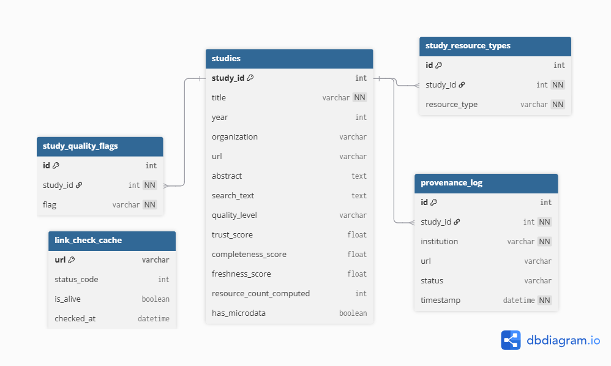

# GenderLens RW

**A smart discovery platform that helps CSOs and policy actors in Rwanda find, trust, and use gender-related data for evidence-based advocacy.**

---

## Table of Contents

- [Overview](#overview)
- [Architecture](#architecture)
- [Modules](#modules)
  - [Search Engine](#search-engine)
  - [Filters](#filters)
  - [Quality Badges](#quality-badges)
  - [Provenance Tracker](#provenance-tracker)
  - [Link Checker](#link-checker)
  - [Export Engine](#export-engine)
- [Getting Started](#getting-started)
- [Project Structure](#project-structure)
- [Usage Examples](#usage-examples)
- [Data Model](#data-model)

---

## Overview

GenderLens RW is a Streamlit-based web application designed to serve as a centralized discovery platform for gender-related datasets in Rwanda. It enables Civil Society Organizations (CSOs), researchers, and policy actors to:

- **Search** datasets using semantic (TF-IDF) and fuzzy matching
- **Filter** results by year, organization, resource type, quality level, and microdata availability
- **Assess trust** through automated quality scoring and visual badges
- **Track provenance** with citation formatting and access logging
- **Verify data links** via HTTP health checks
- **Export** findings as CSV files, policy briefs, and comparison reports

---

## Architecture

```
┌─────────────────────────────────────────────────┐
│                 Streamlit UI                    │
│              (pages/ directory)                 │
├──────────┬──────────┬──────────┬────────────────┤
│  Search  │ Filters  │ Quality  │    Export      │
│  Engine  │          │ Badges   │    Engine      │
├──────────┴──────────┴──────────┴────────────────┤
│          Provenance Tracker                     │
│          Link Checker                           │
├─────────────────────────────────────────────────┤
│          Data Layer (data/sample/)              │
└─────────────────────────────────────────────────┘
```

The platform follows a modular architecture where each concern (search, filtering, quality assessment, provenance, link checking, export) is handled by a dedicated module under `src/`. These modules are composed together by the Streamlit pages to deliver the full user experience.

---

## Modules

### Search Engine

**File**: `src/search_engine.py`

Provides semantic search over a DataFrame of studies using a two-tier strategy:

1. **TF-IDF Vector Search** (primary) — Uses scikit-learn's `TfidfVectorizer` with English stop-word removal, a vocabulary cap of 5,000 features, and unigram/bigram tokenization. Queries are compared against the document corpus via cosine similarity.
2. **Fuzzy Matching** (fallback) — When TF-IDF returns zero results, the engine falls back to `difflib.SequenceMatcher` with a configurable similarity cutoff (default: 0.3).

#### Key Class: `SearchEngine`

| Method | Description |
|---|---|
| `__init__(df, text_column)` | Initializes the engine by fitting a TF-IDF matrix on the specified text column of the DataFrame. |
| `tfidf_search(query, top_k)` | Returns up to `top_k` results as `(index, score)` tuples, sorted by descending cosine similarity. Only includes results with score > 0. |
| `fuzzy_search(query, top_k, cutoff)` | Fuzzy fallback using `SequenceMatcher`. Returns results above the similarity `cutoff`. |
| `search(query, top_k)` | Combined search: tries TF-IDF first, falls back to fuzzy. Returns a DataFrame with an added `relevance_score` column. |
| `highlight_terms(text, query)` | Static method. Wraps query terms in `**bold**` markdown for display highlighting. |

#### How It Works

```
User Query
    │
    ▼
TF-IDF Vectorize Query
    │
    ▼
Cosine Similarity vs. Corpus
    │
    ├── Results found? → Return ranked DataFrame
    │
    └── No results → Fuzzy SequenceMatcher fallback
                          │
                          └── Return ranked DataFrame (or empty)
```


### Filters

**File**: `src/filters.py`

Provides composable, chainable filter functions for narrowing down study datasets. Each filter function accepts a DataFrame and an optional filter parameter—returning the DataFrame unchanged if the parameter is `None` or empty.

#### Functions

| Function | Parameter | Description |
|---|---|---|
| `filter_by_year_range(df, year_range)` | `Tuple[int, int]` | Filters studies to those published within `[min_year, max_year]` (inclusive). |
| `filter_by_organization(df, organizations)` | `List[str]` | Filters to studies whose `organization` column matches any value in the list. |
| `filter_by_resource_type(df, resource_types)` | `List[str]` | Filters to studies with at least one overlapping resource type (set intersection). |
| `filter_by_quality_level(df, levels)` | `List[str]` | Filters by `quality_level` values: `"good"`, `"warning"`, or `"critical"`. |
| `filter_by_has_microdata(df, has_microdata)` | `bool` | Filters by the `has_microdata` boolean flag. |
| `apply_filters(df, ...)` | All of the above | Convenience function that applies all filters in sequence. |

#### Design Principles

- **Null-safe**: Every filter passes through the DataFrame if its parameter is `None`/empty.
- **Composable**: Filters can be chained individually or combined via `apply_filters()`.
- **Non-destructive**: All filters return new DataFrames without modifying the original.

---

### Quality Badges

**File**: `src/quality_badges.py`

Renders visual quality indicators for study datasets. Supports three quality tiers:

| Level | Emoji | Color | Hex Code |
|---|---|---|---|
| Good | 🟢 | Green | `#10B981` |
| Warning | 🟡 | Amber | `#F59E0B` |
| Critical | 🔴 | Red | `#EF4444` |

#### Functions

| Function | Description |
|---|---|
| `quality_emoji(level)` | Returns the emoji character for a quality level (e.g., `"good"` → 🟢). Returns ⚪ for unknown levels. |
| `quality_label(level)` | Returns a human-readable label (e.g., `"good"` → `"Good"`). Returns `"Unknown"` for unrecognized levels. |
| `quality_badge_html(level)` | Returns a styled HTML `<span>` badge with background tinting, colored text, and a subtle border. Suitable for rendering via `st.markdown(..., unsafe_allow_html=True)`. |


### Provenance Tracker

**File**: `src/provenance.py`

Tracks data access history and generates properly formatted citations. Maintains an in-memory provenance log keyed by `study_id`.

#### Functions

| Function | Description |
|---|---|
| `log_access(study_id, institution, url, status)` | Records a data access event with a UTC timestamp. Appends to the in-memory log under the given `study_id`. |
| `get_provenance(study_id)` | Returns the list of all provenance records for a study. |
| `format_citation(title, organization, year, url)` | Generates a citation string in the format: `Organization (Year). Title. Retrieved from URL. Accessed YYYY-MM-DD.` |
| `format_provenance_note(title, institution, url, year)` | Generates a markdown-formatted provenance note with source details and access timestamp. |
| `clear_provenance()` | Clears the entire in-memory provenance log. |

#### Citation Format

```
Organization (Year). Title. Retrieved from URL. Accessed YYYY-MM-DD.
```

Example:
```
NISR (2022). Rwanda Gender Statistics Report. Retrieved from https://example.org/report. Accessed 2026-03-20.
```


### Link Checker

**File**: `src/link_checker.py`

Validates dataset URLs using HTTP HEAD requests with session-level caching to minimize redundant network calls.

#### Functions

| Function | Description |
|---|---|
| `check_url(url, timeout)` | Sends an HTTP HEAD request (default timeout: 5s). Returns `(status_code, is_alive)`. Results are cached in-memory. Returns `(0, False)` for invalid/empty URLs. |
| `status_badge(status_code, is_alive)` | Returns an emoji badge: `🟢 Online`, `🔴 Error (4xx/5xx)`, or `⚫ Unreachable`. |
| `clear_cache()` | Clears the URL check cache for re-validation. |

#### Status Mapping

| Condition | Badge |
|---|---|
| Status < 400 | 🟢 Online |
| Status >= 400 | 🔴 Error (status_code) |
| Request failed / no URL | ⚫ Unreachable |


### Export Engine

**File**: `src/export.py`

Generates downloadable outputs for users—CSV data exports, formatted policy briefs, and multi-study comparison reports.

#### Functions

| Function | Description |
|---|---|
| `export_studies_csv(df)` | Exports a selection of key study columns to a CSV string, ready for `st.download_button`. Columns include: `study_id`, `title`, `year`, `organization`, `url`, `quality_level`, `trust_score`, `completeness_score`, `freshness_score`, `resource_count_computed`, `has_microdata`. |
| `generate_policy_brief(study_row, scenario)` | Generates a markdown-formatted policy brief for a single study. Includes quality assessment table, data caveats (for warning/critical quality), quality flags, and a formatted citation. |
| `generate_comparison_report(df)` | Generates a markdown comparison report across multiple studies, listing each study's organization, year, trust score, and quality level. |

#### Policy Brief Structure

```
# Policy Brief: [Title]

- Prepared date, Source, Scenario
- Key Data Source (abstract)
- Data Quality Assessment (trust, completeness, quality level, resources)
- Quality caveats (if applicable)
- Citation

Footer: Generated by GenderLens RW
```

---

## Getting Started

### Prerequisites

- Python 3.9+
- pip

### Installation

```bash
# Clone the repository
git clone https://github.com/your-org/team-genderlens-gdrh-2026.git
cd team-genderlens-gdrh-2026

# Create and activate a virtual environment
python -m venv .venv
# Windows
.venv\Scripts\activate
# macOS/Linux
source .venv/bin/activate

# Install dependencies
pip install pandas scikit-learn requests streamlit
```

### Running the App

```bash
streamlit run pages/<main_page>.py
```

### Running Tests

```bash
pytest tests/
```


## Project Structure

```
team-genderlens-gdrh-2026/
├── README.md                  # This documentation
├── assets/                    # Static assets (images, CSS)
├── data/
│   └── sample/                # Sample datasets for development/testing
├── pages/                     # Streamlit page modules (UI layer)
├── src/
│   ├── search_engine.py       # TF-IDF + fuzzy search engine
│   ├── filters.py             # Composable data filters
│   ├── quality_badges.py      # Quality tier visualization
│   ├── provenance.py          # Access logging & citation formatting
│   ├── link_checker.py        # URL health monitoring
│   ├── export.py              # CSV, policy brief, and report generation
│   └── pipeline/              # Data ingestion pipeline (planned)
├── tests/                     # Test suite
└── .streamlit/                # Streamlit configuration
```

---

## Usage Examples

### Searching for Studies

```python
from src.search_engine import SearchEngine

engine = SearchEngine(df, text_column="search_text")
results = engine.search("maternal health Rwanda", top_k=10)
print(results[["title", "relevance_score"]])
```

### Applying Filters

```python
from src.filters import apply_filters

filtered = apply_filters(
    df,
    year_range=(2018, 2025),
    organizations=["NISR", "UN Women"],
    quality_levels=["good", "warning"],
)
```

### Generating a Policy Brief

```python
from src.export import generate_policy_brief

study = df.iloc[0]
brief = generate_policy_brief(study, scenario="advocacy")
print(brief)
```

### Checking a Dataset Link

```python
from src.link_checker import check_url, status_badge

status_code, is_alive = check_url("https://example.org/dataset")
print(status_badge(status_code, is_alive))  # 🟢 Online
```

### Formatting a Citation

```python
from src.provenance import format_citation

citation = format_citation(
    title="Rwanda Gender Statistics Report",
    organization="NISR",
    year=2022,
    url="https://example.org/report",
)
# NISR (2022). Rwanda Gender Statistics Report. Retrieved from https://example.org/report. Accessed 2026-03-20.
```


## Data Model

The platform expects a pandas DataFrame with the following columns:

| Column | Type | Description |
|---|---|---|
| `study_id` | `int` | Unique identifier for each study/dataset |
| `title` | `str` | Study title |
| `year` | `int` | Publication year |
| `organization` | `str` | Publishing institution |
| `url` | `str` | Direct link to the dataset/study |
| `abstract` | `str` | Summary/abstract text |
| `search_text` | `str` | Concatenated searchable text (used by SearchEngine) |
| `resource_types` | `list[str]` | List of resource type tags |
| `quality_level` | `str` | One of `"good"`, `"warning"`, `"critical"` |
| `trust_score` | `float` | Composite trust score (0.0–1.0) |
| `completeness_score` | `float` | Metadata completeness (0.0–1.0) |
| `freshness_score` | `float` | Data freshness metric (0.0–1.0) |
| `resource_count_computed` | `int` | Number of associated resources |
| `has_microdata` | `bool` | Whether microdata is available |
| `quality_flags_list` | `list[str]` | List of quality issue flags |

### Database Diagram (DBML)



